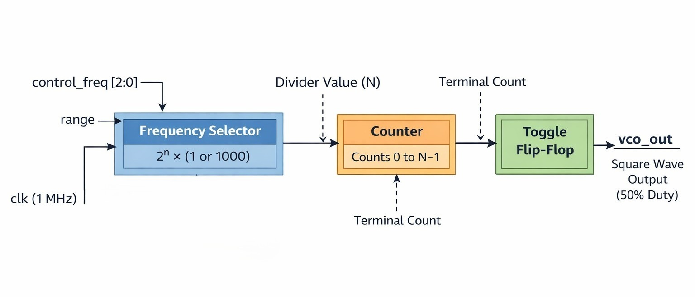
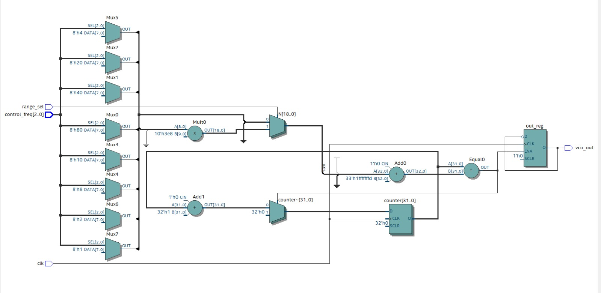
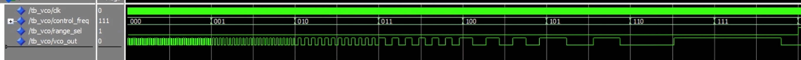
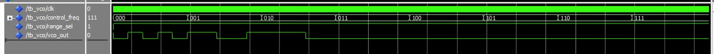

# Digital Square Wave VCO 



---

## Overview
This project implements a **Digital Voltage-Controlled Oscillator (VCO)** in **VHDL**.
The design generates a **50% duty-cycle square wave** with selectable output frequencies
based on a control word and a frequency range selector.

The design is fully synchronous and suitable for FPGA implementation.

---

## Ports

```vhdl
PORT (
    clk          : in  std_logic;                    -- 1 MHz clock
    control_freq : in  std_logic_vector(2 downto 0); -- Frequency selection
    range        : in  std_logic;                    -- 0: kHz, 1: Hz
    vco_out      : out std_logic                     -- Square wave output
);
````

### Inputs

* **clk** → 1 MHz reference clock
* **control_freq[2:0]** → Selects frequency level
* **range** → Selects frequency range

  * `0` → kHz range
  * `1` → Hz range

### Output

* **vco_out** → Square wave output (50% duty cycle)

---

## Design Architecture

The VCO is divided into **three main blocks**:

---

### Block 1: Frequency Selector

#### Purpose

Convert `(control_freq, range)` into a divider value **N**.

#### Logic

* `control_freq` selects using 3 bit input
  
* `range` scales the frequency:

  * `1` → kHz mode
  * `1000` → Hz mode

📌 **Divider Equation**

```
N = clk_freq / 2(control_freq)
```

📌 The output of this block is the divider value **N**, which controls the counter.

---

## VCO Frequency Selection Table

*(1 MHz Input Clock)*

| Row | control_freq | range_sel | N (decimal) | vco_out Frequency | Notes                          |
| --- | ------------ | --------- | ----------- | ----------------- | ------------------------------ |
| 1   | "000"        | '0'       | 1           | 500 kHz           | Highest frequency (low range)  |
| 2   | "001"        | '0'       | 2           | 250 kHz           |                                |
| 3   | "010"        | '0'       | 4           | 125 kHz           |                                |
| 4   | "011"        | '0'       | 8           | 62.5 kHz          |                                |
| 5   | "100"        | '0'       | 16          | 31.25 kHz         |                                |
| 6   | "101"        | '0'       | 32          | 15.625 kHz        |                                |
| 7   | "110"        | '0'       | 64          | 7.8125 kHz        |                                |
| 8   | "111"        | '0'       | 128         | 3.90625 kHz       | Lowest frequency (low range)   |
| 9   | "000"        | '1'       | 1000        | 500 Hz            | Highest frequency (high range) |
| 10  | "001"        | '1'       | 2000        | 250 Hz            |                                |
| 11  | "010"        | '1'       | 4000        | 125 Hz            |                                |
| 12  | "011"        | '1'       | 8000        | 62.5 Hz           |                                |
| 13  | "100"        | '1'       | 16000       | 31.25 Hz          |                                |
| 14  | "101"        | '1'       | 32000       | 15.625 Hz         |                                |
| 15  | "110"        | '1'       | 64000       | 7.8125 Hz         |                                |
| 16  | "111"        | '1'       | 128000      | 3.90625 Hz        | Lowest frequency overall       |

**Notes:**

* Assumes a **1 MHz input clock** (`clk`)
* Output frequency:

  ```
  f_vco_out = 1,000,000 / (2 × N)
  ```
* `vco_out` is a **50% duty-cycle square wave**
* Rows 1–8 → `range_sel = '0'` (kHz range)
* Rows 9–16 → `range_sel = '1'` (Hz range)

---

### Block 2: Counter

#### Purpose

Count clock cycles until reaching **N**.

#### Operation

* Clocked by `clk`
* Counts from `0 → N − 1`
* When count reaches `N − 1`:

  * Counter resets to zero
  * Toggle signal is generated

---

### Block 3: Toggle Flip-Flop

#### Purpose

Generate the square wave output.

#### Operation

* Toggles its state every time the counter finishes
* Ensures a **50% duty cycle** automatically

---

## Internal Signals

### 1️⃣ Divider Value (N)

* Derived from `control_freq` and `range`
* Used by the counter
* Computed inside the **clocked process** to keep the design synchronous

**Type:** `integer`

---

### 2️⃣ Counter

* Counts from `0 → N − 1`
* Maximum divider value:

```
N_max = 2^7 × 1000 = 128000
```

Required counter width:

```
2^17 = 131072  → sufficient
```

**Type used:**

```vhdl
unsigned(16 downto 0)
```

---

### 3️⃣ Toggle Flip-Flop

* Output register that generates the square wave

**Type:**

```vhdl
out_reg : std_logic;
```
---
---

## RTL Viewer (Register Transfer Level)

The RTL viewer illustrates the synthesized hardware structure of the Digital VCO.
It confirms that the design is implemented using a **counter**, **combinational
frequency selection logic**, and a **toggle flip-flop**, all driven by a single
clock domain.



### RTL Observations
- Fully synchronous design driven by `clk`
- Frequency selection logic implemented as combinational logic
- Counter used as a programmable clock divider
- Toggle flip-flop ensures a 50% duty-cycle output
- No inferred latches
- Suitable for CPLD/FPGA implementation

---

## Simulation Results

### Range = 0 (kHz Mode)



This simulation shows the **8 frequency levels** generated when `range = 0`.

---

### Range = 1 (Hz Mode)



This simulation shows the **8 frequency levels** generated when `range = 1`.

---

## Tools Used

* **Quartus Prime**
* **ModelSim**
